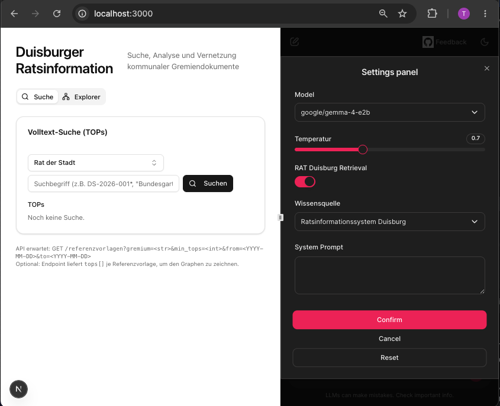
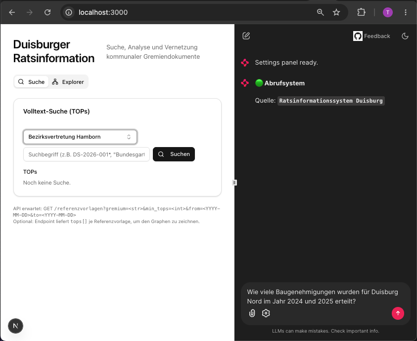

# End-to-end RAG workflow - Work in Progress

Dieses Projekt implementiert einen Retrieval-Augmented-Generation-(RAG)-Workflow für Ratssitzungen der Stadt Duisburg.

Datengrundlage ist das öffentliche Ratsinformationssystem der Stadt Duisburg.

[//]: # (Das Projekt hostet kein eigenes Large Language Model &#40;LLM&#41;, sondern verfolgt einen BYOM-Ansatz &#40;"Bring Your Own Model/API Key"&#41;. )

[//]: # (Nutzer können eigene API-Zugänge zu extern gehosteten Modellen &#40;z. B. OpenAI, Anthropic oder Mistral&#41; verwenden.)

  
  

## Daten- und Dokumentenerschließung
- Crawling des Bürgerportals des Ratsinformationssystems Duisburg

- basiert auf Technologie *Active Server Pages (.asp)*

- https://sessionnet.owl-it.de/duisburg/bi/info.asp

| URL Muster | Bedeutung |
|---|---|
| `gr[xxxx].asp` | Gremien |
| `si[xxxx].asp` | Sitzungen |
| `kp[xxxx].asp` | Personen / Mandatsträger |
| `pe[xxxx].asp` | Person detail |
| `vo[xxxx].asp` | Vorlagen |
| `do[xxxx].asp` | Dokumente |

### Abbildung von Strukturen und Zusammenhängen
- Darstellung in einer Graph-Datenbank (Neo4j): 
  - Gremien -> Sitzungen
  - Sitzungen -> Personen
  - Personen -> Parteien & Fraktionen
  - Parteien -> Abstimmungsverhalten

    
## Extraktion von Inhalten & Informationen
- Für jeden Tagesordnungspunkt einer Sitzung
  - Selektierung & Auslesung des Eintrags in der Niederschrift (pdf)
  - Zusammenfassung mit Hilfe LLM
  - Chunking & Embedding**
  - DB-ing für Vektorsuche ("Qdrant"/Rust)
    - DB Metadaten: 
      - Datum, 
      - Sitzung- und TOP-ID, 
      - Abstimmungsergebnis/-verhalten
- Für jede Anlage / Eintrag Vorlage (meist pdf)"
  - Bei Texten: Verfahren wie für TOP (s. oben)
  - Bei Graphiken: LLM Zusammenfassung

** *paraphrase-multilingual-MiniLM-L12-v2* (Lib: sentence_transformers)

## Workflow und Nutzer-Schnittstelle
- Chatfenster: Chainlit
- Lokale LLM Bereitstellung via Ollama (testing LM Studio)
- Workflow:
  1. Text Eingabe Nutzer
  2. Embedding und Vektor Suche (Qdrant)
  3. Relevanzranking Suchergebnisse 
  4. Promtgenerierung einschließlich Guardrailing
  5. LLM Feed und Stream vom Ergebnis zur Nutzeroberfläche